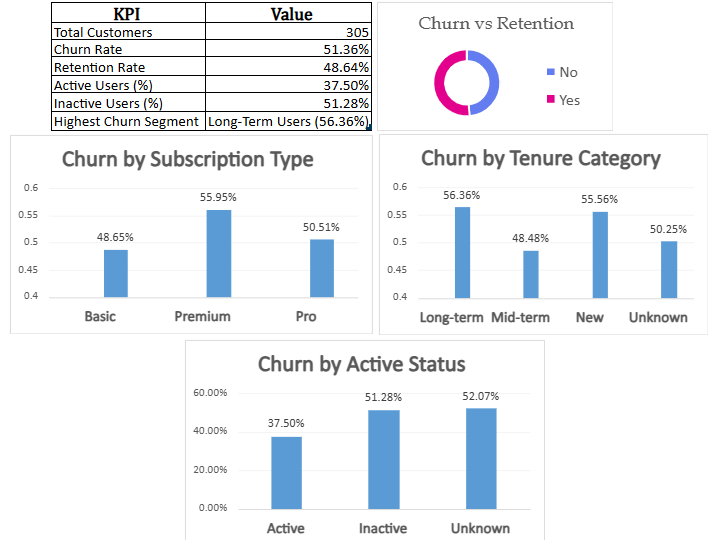
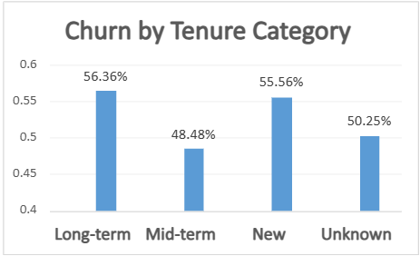

# 📉 Customer Churn Analysis (Excel Project)

Excel-based customer churn analysis using dashboards and KPIs.

---

## 🚀 Project Overview
This project analyzes customer churn data to identify patterns and drivers behind customer attrition. The objective is to understand which customer segments are more likely to churn and provide actionable insights to improve retention.

---

## 📁 Dataset Summary
- Total customers: 305
- Key dimensions analyzed:
  - Subscription type
  - Tenure category
  - Active status
  - Churn vs retention

---

## 🧹 Data Cleaning & Preparation
- Removed duplicate records  
- Standardized categorical values  
- Checked and handled missing values  
- Created churn indicators and calculated churn rates  
- Structured data for pivot-based analysis  

---

## 📊 Key Metrics
- **Churn Rate:** 51.36%  
- **Retention Rate:** 48.64%  
- **Active Users:** 37.50%  
- **Inactive Users:** 51.28%  
- **Highest Churn Segment:** Long-term users (56.36%)

---

## 📊 Dashboard Overview

---

## 🔍 Key Insights

### 1️⃣ Churn by Subscription Type

- Premium users show the highest churn  
- Basic plan has comparatively lower churn  

---

### 2️⃣ Churn by Tenure Category

- Long-term customers exhibit the highest churn  
- Mid-term users are more stable  

---

### 3️⃣ Churn by Active Status
Churn by Active Status.png 
- Inactive users churn significantly more than active users  

---

## 🧭 Recommendations
- Revisit Premium pricing or value proposition  
- Introduce loyalty programs for long-term users  
- Proactively engage inactive customers  
- Monitor churn indicators regularly  

---

## 🧠 Tools Used
- Microsoft Excel  
- Pivot Tables  
- Charts & Dashboards  
- Data Cleaning & Analysis  
