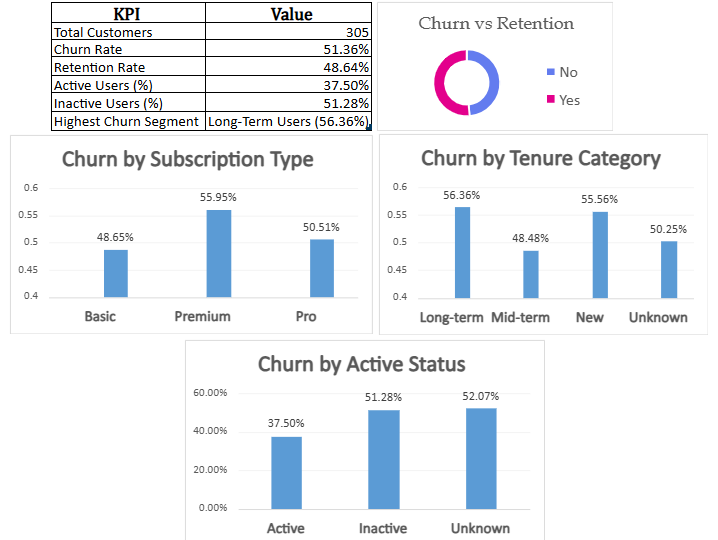

# Customer Churn Analytics — End-to-End Case Study

> **From customer data to retention decisions:** data cleaning, churn segmentation, KPI analysis, visualization, and actionable retention recommendations.

## Business Question

**Which customer segments are most exposed to churn, and where should retention efforts be focused?**

This project analyzes customer-level subscription and engagement data to identify churn patterns across **subscription type, tenure, and activity status**. The emphasis is on understanding *where churn is concentrated* and translating those patterns into practical retention actions.

---

## Analytical Workflow

```text
Customer Data
    ↓
Data Cleaning & Validation
    ↓
Churn Metric & Segment Definition
    ↓
Comparative Analysis
    ↓
Dashboard & KPI Reporting
    ↓
Retention Insights
    ↓
Business Recommendations
```

### 1. Data preparation

The dataset was prepared for analysis by:

- Removing duplicate records
- Standardizing categorical values
- Checking and handling missing or inconsistent values
- Creating churn/retention indicators
- Structuring the customer table for segmentation and reporting

### 2. Churn analysis

The analysis evaluates churn across:

- **Subscription type**
- **Tenure category**
- **Active vs inactive status**
- Overall churn and retention performance

### 3. Decision framing

Rather than treating churn as a single overall percentage, the analysis identifies **high-risk customer segments** and uses those patterns to prioritize retention interventions.

---

## Key Metrics

| Metric | Result |
|---|---:|
| Total Customers | 305 |
| Churn Rate | **51.36%** |
| Retention Rate | **48.64%** |
| Active Users | **37.50%** |
| Inactive Users | **51.28%** |
| Highest Churn Segment | **Long-term users — 56.36%** |

---

## Dashboard

The original spreadsheet dashboard is positioned as the reporting layer for this **customer retention analytics case study**. The workbook remains the underlying analysis artifact; the portfolio narrative focuses on the analytical reasoning, findings, and business actions.



---

## Key Findings

### 1. Churn is structurally high

The overall churn rate is **51.36%**, meaning more than half of the analyzed customer base has churned. This makes retention a material business problem rather than a marginal optimization opportunity.

### 2. Long-tenure customers are not automatically safer

Long-term users show the **highest churn rate at 56.36%**. This challenges the assumption that longer tenure necessarily implies stronger loyalty and suggests that retention strategy should distinguish between *tenure* and *current engagement/value*.

### 3. Inactivity is a strong warning signal

Inactive customers show substantially weaker retention outcomes than active customers. This makes **re-engagement and early activity monitoring** a logical intervention area.

### 4. Subscription mix matters

Churn differs across subscription types, making plan-level retention analysis useful for identifying where pricing, value perception, onboarding, or product engagement may need attention.

---

## Business Recommendations

### 1. Build an early-warning retention workflow

Use inactivity and declining engagement as triggers for proactive outreach before customers become fully disengaged.

### 2. Investigate long-tenure churn

Audit the customer journey beyond the initial acquisition period to identify why established users are leaving despite longer tenure.

### 3. Review plan-level value perception

Compare churn by subscription type and examine whether pricing, feature usage, or perceived value differences are contributing to attrition.

### 4. Prioritize retention by risk, not only by customer age

Retention resources should be allocated using behavioral and segment-level risk signals rather than assuming that newer customers are always the highest priority.

---

## Repository Structure

```text
├── README.md
├── Customer_Churn_Analysis.xlsx
└── screenshots/
    ├── churn_dashboard_full.png
    ├── churn_by_subscription_type.png
    ├── churn_by_tenure_category.png
    └── churn_by_active_status.png
```

The Excel workbook is retained as the **analysis artifact and source for the reported results**. It is not positioned as an Excel-formatting exercise; the portfolio presentation emphasizes customer analytics, segmentation, and retention decisions.

---

## Tools & Skills Demonstrated

**Analytics**
- Data Cleaning & Validation
- Customer Segmentation
- Churn Analysis
- KPI Analysis
- Comparative Analysis
- Retention Strategy

**Reporting & Visualization**
- Excel
- Pivot Tables
- KPI Reporting
- Dashboard Design
- Comparative Visualizations

**Business Concepts**
- Churn & Retention
- Customer Lifecycle
- Engagement Risk
- Subscription Performance
- Retention Prioritization

---

## Project Outcome

This case study demonstrates how customer data can be transformed into **segment-level churn intelligence and actionable retention priorities**—moving beyond simply reporting churn to identifying where intervention is most likely to matter.

---

### Aashka Tanvi

**Data Analytics | Customer Analytics | Business Intelligence**
